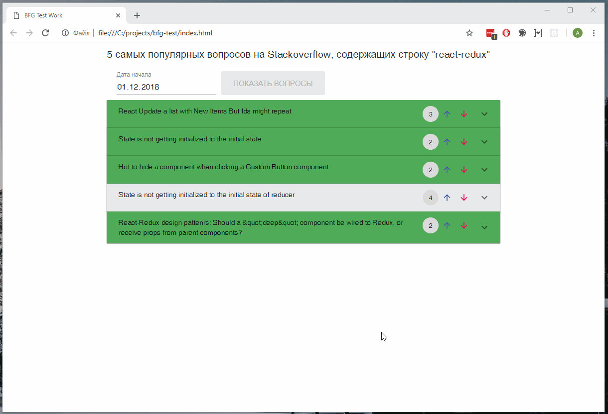

# BFG Grouo Test Work
Test app with react-redux

## Usage local
You need install:
* [Node.js](https://nodejs.org) and [Npm](https://www.npmjs.com/)

Write in command line
```bash
git clone https://github.com/aleksnick/bfg-test.git
cd bfg-test
npm install 
npm run start
```

If you encounter problems, run:
```bash
npm run build
```
and open `index.html` in your browser


## How it looks

